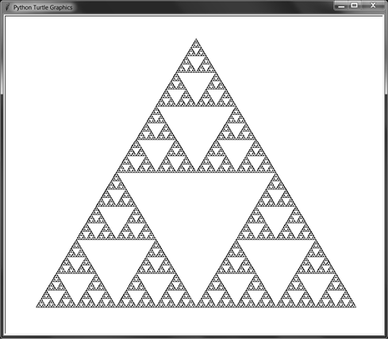

# name of the project
***
]
This program generates a sierpinski triangle, creating a cool fractal that seems to be endless. It can be in any color, and it is made using the turtle library in python. It uses a special principle in python called recursion, where a function executes inside of itself continuously until the fractal finishes. It has a depth from 1-9, you can go higher if you want, but your computer may crash. To conclude it, it is a cool Sierpinski Triangle Generator.

## How to use the project
***
It is easy to use!
1. You must enter the triangle color e.g.: red
2. You enter the background color
3. Enter the recursion depth (1-9)
4. You may have to wait a few seconds for it to generate
5. If you theoretically typed more than 9, it will work but you will have to wait several minutes
There should be nothing extra you have to install (unless you have to install python)

## list of key features
***
Generates a sierpinski triangle in any color, with a recursion depth of 1-9.
Simple but good!

## installation instructions
***
There should be no files you have to install!

## contributors
elijahhawkins-the-maker